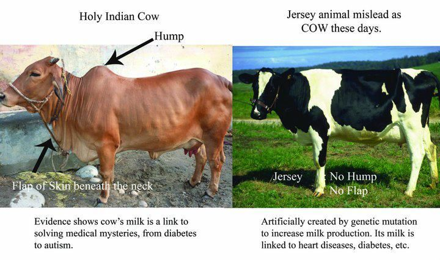

## Introducation

Yes Foreign Breed (A1) Cows Milk
Biggest cause of Heart Disease and Diabetes.

Indian Breed (A2) Cows Milk is Close to A2 type Beta Casein Protein which is Very Close to MOTHER's Milk and prevents all Diseases.

## A1-Cow vs A2-Cow

A1 Cow-ForeignBreed(Without Hump)

- Foreign breeds are fed even NonVeg Diet to boost MilkProtein
- A1 Breed which is High in Volume, But Low on Protein and Other Vitamins
- A1 beta casein
- A1 casein protein has BCM 7 compound, it can cause heart diseases, diabetes & schizophrenia etc. This is why some western people are allergic to milk.  
- It give can birth only to 4 to calves.

'A2 Cow'-IndianDesi(With Hump)

- A2 Cow Milk& Ghee is the Best
- Boosts Immunity,EyeSight &Stamina
- Never lets Bone Joint issue/pain
- Boosts Memory & Intellect
- A2 beta casein 
- Desi cow brands don't have A1 beta casein, so their milk is healthy.
- It only says OM and Amba, which are names of the God
- More than 15 times Its gives birth to calves

There are two types of protein in cow milk called Whey & Casein.
Again casein can be broken down to three parts
Alpha, Beta and Kapa casein

Foreign breeds like jersey have A1 beta casein which is harmful to body,

Desi cow breeds have A2 beta casein which is good for health.

## Benefits In Regular Consumption's of Desi Indian Cow

- Calcium/Vitamin B12 for healthy bones, teeth and cells
- Vitamin A: For good eyesight and immune function
- For regulation of the body's rate of metabolism.
- Its good for kidney.
- Regular consumption increase good (HDL Cholesterol
- It helps in the growth and development of childhood brain

Jersey/Holstein Cow Jersey breed/Humpless breeds is a mutated crossbreed animal majorly breed they provide more A1 milk which is low in nutrients and they do not have Surya Ketu vein.

## Harmful Effects Cause Due To Regular Consumption Jersey Foreign Cow

- Jersey cow milk has BCM7 which cause diabetes type 1
- High blood pressure
- Sudden death syndrome in infants
- Metabolic degenerative disease
- Mental disorder in old age
- Heart Attack/cardiac problems
- High blood pressure

## What is Surya Ketu Nadi/Vein

The hump in Vedic indian cows has a specific vein called Surya Ketu Nadi/Vein which is absent in foreign ones. This indian cow (vein) absorbs all the energies and radiations from sun, moon and all luminaries from universe and puts them in cow products like milk, urine, dung, ghee (clarified butter) etc.

In cow products of foreign species this divine effect of Surya Ketu Nadi is absent.
Surya ketu Vein, on interaction with solar rays produces gold salts in her blood. These salts are present in the cow’s milk and cow’s other bodily fluids. Just Because of that the Vedic cow’s milk, butter and ghee has golden hue.

## Generic Ways To Know Your Milk is A2 Desi Cow

- Colour: Desi cows milk has higher fat content when compared to Jersey/HF Milk. The Milk is tad bit yellowish compared to the supernova White of Jersey/HF Milk.
- Smell: Desi cows milk has a nice smell. (But again this all depends on the food ration the cow intakes.)
- Taste: Though Desi cows milk has rich smell. Again this all depends on various factors.