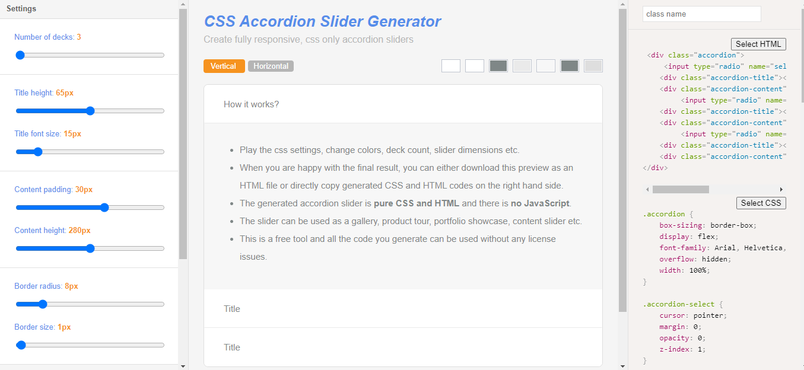
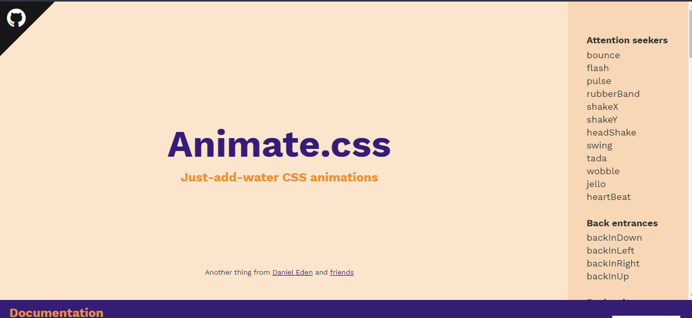
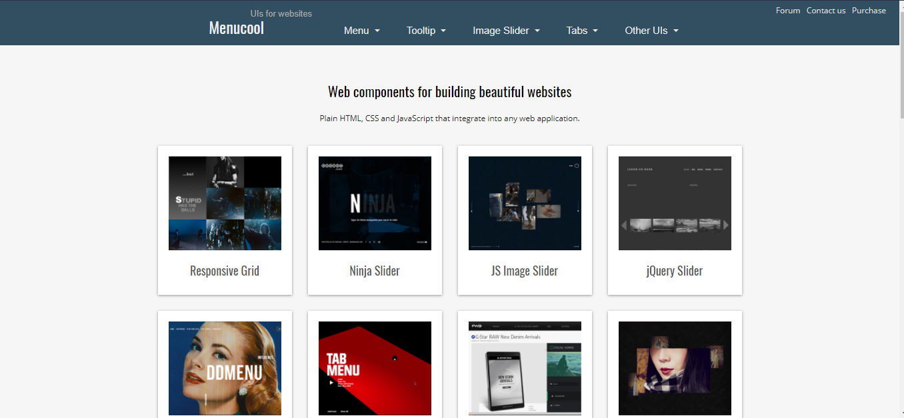
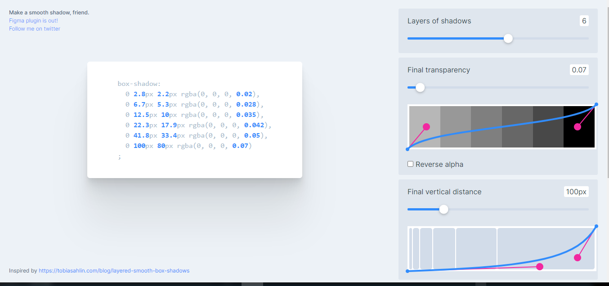
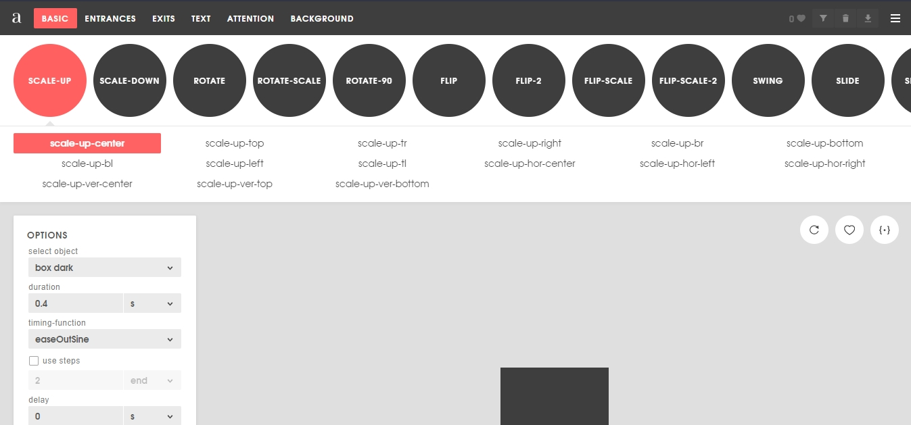

<!-- more -->

Great tools made on CSS which can help Front End Developers a lot of time
<!-- more -->

## 1.CSS Accordion Slider Generator

This tool is a free online generator that allows you to create a cross browser css only (no javascript) responsive "Accordion Slider" in seconds.

### Features
*   CSS only, you don't need to write a single line of javascript code
*   Fully responsive and touch friendly
*   You can create both vertical and horizontal sliders
*   15 color themes
*   Smooth transition effect between decks
*   Any HTML content can be used as a deck content

[Go To Website](https://accordionslider.com/)

## 2.Animate.css

Animate is a CSS library for basic CSS animation. Its a browser friendly with a lot of pre built animations

[Go To Website](https://animate.style/)

## 3.Navbar Generator 

 You can generate 5 types of nav bar using few clicks, which are fully responsive 
 

[Go To Website](http://www.menucool.com/)

## 4.Smooth Shadow

Shadow generator with great UI

[Go To Website](https://shadows.brumm.af/)

## 5.Animista

Animista is a place where you can play with a collection of ready to use CSS animations, tweak them and download only those you will actually use.

[Go To Website](https://animista.net/)