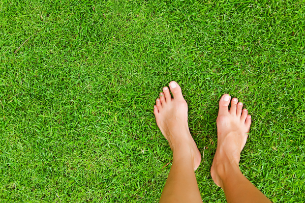

<!-- more -->
 

We live in a world where walking barefoot is avoided. The modern world believes that walking barefoot is not appropriate, but our indian ancestors were in favour of walking barefoot. Do you know the reason behind it? 

Going barefoot also signifies respect for the earth upon which people
walk. The foot is the body part that touches the earth – the sacred mother of all.
The earth is imbued with generative powers and the foot is thought of as the conduit through which the vital energy of the earth travels through humans unto the cosmos. The fact that ‘We are
electrical beings’ was long understood by our ancestors. Hence the traditional lifestyle hinged around connecting with the earth by either walking barefoot within the house, sleeping on ground, eating while sitting on ground and even kids playing barefoot in the fields. 

As we became more ‘technically advanced’ and ‘socially civilized’, we severed our vital connect with the earth. Walking barefoot was and still is one of the most primal instincts for mankind. Simply walking on the earth, interacting with elements is a part of human nature. 

We have evolved ourselves with weak feet that could once climb rocks, rubble, dirt, sticks, thorns and more with the nice cushion at our soles . By walking barefoot we experience multiple benefits that we don't receive either at all or nearly as much by walking with shoes. One of the more obvious benefits of walking barefoot is that we have a connection to the earth and it's magnetic field. Our body is conductive to the earth and the earth is conductive to our body. 

The earth is full of negative ions and we flood our body with negative ions by walking barefoot, this is also known as earthing or grounding. We need negative ions, especially in today's world. Positive ions are more abundant in cities and anywhere near electronics and electro-magnetic frequencies.
Walking barefoot may also help improve the strength and flexibility
of the muscles and ligaments of the foot which improves the function of the foot, reducing injuries of the foot, and improving posture and balance of the body. Walking barefoot on a clean and soft surface is perfectly fine.