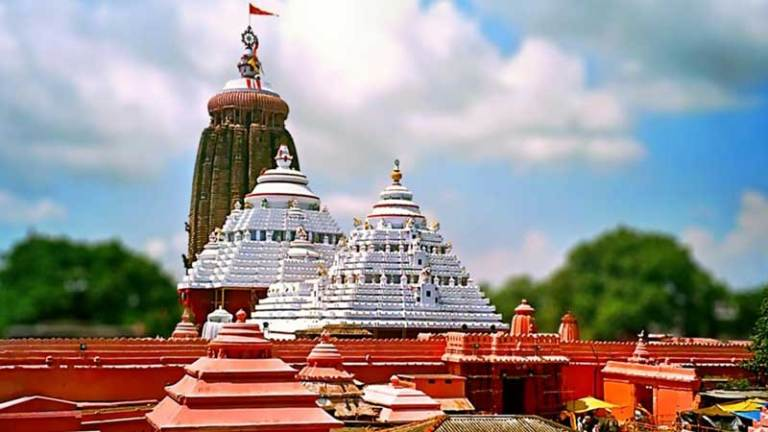

<!-- more -->

 

Jagannath Temple was invaded 17 times mostly by Mughal& Foreign Emperors. Cry and beg as many times as liberal or modern, but it can't substitute the truth, it was destroyed to kill our faith and Tradition.

As "they" knew ancient temples are not just only master pieces, it was also a center for Art, History, Culture, Science, Knowledge and Most importantly a treasury.

## Attack 1

In 1340, Sultan of Bengal, Ilias Shah, blew a lot of blood in the temple complex and killed the innocent people. But King Narasimha Dev 3 succeeded in saving the idols of Jagannath, because the idols were hidden on their order.

## Attack 2

In 1360, Sultan Feroze Shah Tughlaq of Delhi made a second attack on the Jagannath temple.

## Attack 3

In 1509 Ismail Ghazi,commander of Bengal’s Sultan Alauddin Hussain Shah. As soon as the news of the attack came, the priests hid the idols away from the temple,in the island of Chilka Lake, Pratap Rudradev defeated Bengal’s Sultan armies in Hoogly and forced to flee.

## Attack 4

In 1568, the biggest attack on Jagannath temple was done. This attack was done by an Afghan attacker, named Black Mountain (Kala Pahad) . Once again the idols were hidden in the island of Chilka Lake, after the attack. But still the attackers destroyed some temple idols and destroyed them. In this attack, the architecture of the Jagannath temple is greatly damaged. These years were decisive in the history of Odisha. After this year’s war, Odisha came directly under Islamic rule.

## Attack 5

This was followed by a fifth attack on the Jagannath temple in 1592. This attack was done by Sulaiman, son of Osman and son of Kuthu Khan, son of Sultan Isha of Odisha. People were brutally killed, statues were polluted and temple property was looted.

## Attack 6

In 1601, Mirza Khurram, commander of Nawab Islam Khan of Bengal, attacked on Jagannath temple. The priests of the temple hid the idols through a boat through the Bhargavi river in a village near Puri in Kapileswar.

## Attack 7

Hushim Khan, the Subedar of Odisha attacked the temple. before the attack, the idols were hidden in the Gopal temple in Khurda. This place is about 50 kilometers away from the temple. The temple also suffered a lot in this attack. In 1608, idols were brought back.

## Attack 8

Hindu warrior who worked in the army of Hashim Khan was the eighth attack on the temple. There were idols in the temple at that time. The temple money was looted and it was turned into a fort

## Attack 9

On 1611 king Kalyan Mal, son of King Todd Ram, who was involved in the navratanas of Mughal emperor Akbar attacked temple. This time too the priests hid the idols in an island present in the Bay of Bengal.

## Attack 10

This time it was done by Kalyan Mal, the temple was badly plundered in this attack.

## Attack 11

The 11th attack on the temple was carried out in the year 1617 by commander of Jehangir Jehangir, Mukarram Khan. At that time, the idols of the temple were concealed in a place called Gobapadar.

## Attack 12

The 12th attack on the temple was done by Mirza Ahmed Beg, Mughal governor of Odisha in the year 1621. Even once Mughal emperor Shah Jahan visited Odisha, the priests had hidden idols.

## Attack 13

In the year 1641, the temple was attacked for 13th time. This attack was done by Mirza Makki, the Mughal governor of Odisha.

## Attack 14

Same Mirza Makki attacked once more this time as well.

## Attack 15

The 15th attack on the temple was made by Amir Fateh Khan. He looted diamonds, pearls and gold in the temple jewellery.

## Attack 16

The 16th attack on the temple took place in 1692, on the order of the Mughal Emperor Aurangzeb. Aurangzeb had ordered the temple to be completely demolished, then the Nawab of Odisha was Iqram Khan, who was under the Mughals. Ekram Khan looted God’s gold crown by attacking Jagannath temple. At that time the statues of the Jagannath temple were concealed in the temple of Bimala in Shrimandir.

## 17th Attack

Was last attacked in 1699 by Muhammad Taki Khan. Taki Khan was the nb sub-parcel of Odisha from 1727 to 1734. Idols were concealed this time and were shifted to other places continuously. Idols for some time were also kept in Hyderabad.

After the weakening of the Mughal empire in Delhi and the strength of the Marathas increased, the crisis on Temple came to an end and gradually returned the glory of the temple. Due to the survival of idols of the Jagannath temple, the invaders never succeeded in their plans. So, You say in what sense shall we let the Non-Hindus enter the temple premises!
To get invaded and theft again?

>   कदाचित् कालिन्दी तट विपिन सङ्गीत तरलो
>   मुदाभीरी नारी वदन कमला स्वाद मधुपः
>   रमा शम्भु ब्रह्मामरपति गणेशार्चित पदो
>   जगन्नाथः स्वामी नयन पथ गामी भवतु मे