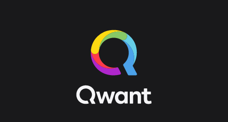
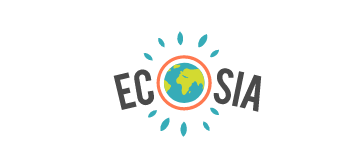

<!-- more -->

```toc
# This code block gets replaced with the TOC
```


Search engine's 'personalized experience' comes at the cost of sharing our personal data and by allowing ourselves to get tracked by Google on the internet. At some point, this personalization becomes annoying when you see too much of tailored content and ads targeting you.
<!-- more -->
Besides, there are many search engines other than Google having so much to offer, not just in terms of privacy but useful features too. So if you are not impressed with Google search results or maybe you are looking for equally good search engines, here is a list of 12 best Google alternative websites you can check out.
______________________________________________________________________________________________________

## [DuckDuckGo](https://duckduckgo.com/) 
* US-based (EU servers for EU, though).
* Mostly Bing, Yahoo and own crawler results 
* Issues: Proprietary, some components are free
### [Terms Of Services](https://tosdr.org/#duckduckgo)  
### [Criticism here](https://gitlab.com/prism-break/prism-break/-/issues/2143) 
DuckDuckGo is brilliant with how they've marketed themselves as privacy-respecting (creating sites like spreadprivacy.com) and this manipulation fools a lot of people.  There are several reasons to remove DDG:
### [Why I don't use DuckDuckGO](https://www.reddit.com/comments/aqz3q8)
<!-- more -->
______________________________________________________________________________________________________

## [SearX](https://searx.xyz/)
* searx.space for other instances
* An instance of the open-source metasearch engine
* You can choose which search engine to use for the results.
* Issues: No privacy policy, some public instances use Cloudflare, ads or may log IP addresses/searches.
______________________________________________________________________________________________________

## [Qwant](https://www.qwant.com/)
* French-based
* Own crawlers and Bing results.
* Issues: "French law makes it mandatory to keep some connection data for one year" 
### [Privacy Policy](https://about.qwant.com/legal/privacy/)
### [Terms Of Service](https://tosdr.org/#qwant)
### Criticism: [Link1](https://www.reddit.com/r/privacy/comments/bstxms/qwants_future_regarding_ethics/) & [Link2](https://forum.vivaldi.net/topic/35097/ethics-a-heavy-suspicion-towards-the-qwant-search-engine)
______________________________________________________________________________________________________

## [MetaGer](https://metager.org/)
* Open-source metasearch engine
* Based in Germany
* Stores some information temporarily: [Link](https://metager.org/datenschutz)
______________________________________________________________________________________________________

## [YaCy](https://yacy.net/)
* Distributed self-hosted search engine, built on P2P networks
______________________________________________________________________________________________________

## [Mojeek](https://www.mojeek.com/)
* Uses its own crawlers

## Other Search Engines:
* List of search engines: [Wikipedia Link](https://en.m.wikipedia.org/wiki/List_of_search_engines)
______________________________________________________________________________________________________

## [Startpage](https://startpage.com/)
* Bought by an ad company
* Uses Goolag search 
### [Briefing](https://restoreprivacy.com/startpage-system1-privacy-one-group)
______________________________________________________________________________________________________

## [Ecosia](https://www.ecosia.org/)
* A bing frontend 
### Privacy Policy: [Click Here](https://info.ecosia.org/privacy#privacy-faq-item-6)
______________________________________________________________________________________________________

## [Gigablast](https://gigablast.com/)
* Fails SSL at Mozilla observatory
* https://observatory.mozilla.org/analyze/www.gigablast.com
______________________________________________________________________________________________________

## [Yippy](https://yippy.com/)
* Uses Goolag ads
______________________________________________________________________________________________________

## [SwissCows](https://swisscows.com/)
______________________________________________________________________________________________________

## [Disconnect](https://search.disconnect.me/)
* Connects to Amazon
______________________________________________________________________________________________________

## [Wolfram Alpha](https://www.wolframalpha.com/)
* Doesn't even work without JavaScript
______________________________________________________________________________________________________

## [Lukol](https://www.lukol.com/)
* Shares data with Goolag
* Privacy policy: [Click Here](https://www.lukol.com/privacy.php)